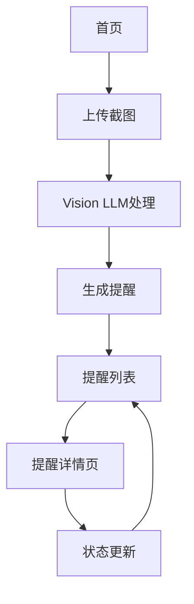

## 1. 产品概述
聊天截图提醒工具帮助用户通过上传聊天截图，自动识别并提取重要信息，设置定时提醒，确保不错过重要事项。

## 2. 核心功能

### 2.1 用户角色
| 角色 | 注册方式 | 核心权限 |
|------|----------|----------|
| 普通用户 | 邮箱注册 | 上传截图、查看提醒、管理提醒状态 |

### 2.2 功能模块
产品包含以下主要页面：
1. **首页**：截图上传、提醒列表展示、状态概览
2. **提醒详情页**：提醒内容详情、状态更新、编辑功能

### 2.3 页面详情
| 页面名称 | 模块名称 | 功能描述 |
|----------|----------|----------|
| 首页 | 截图上传区域 | 拖拽或点击上传聊天截图，支持常见图片格式，显示上传进度 |
| 首页 | 提醒列表 | 展示所有提醒事项，包含提取的内容、设定时间、当前状态 |
| 首页 | 状态概览 | 显示待处理、已完成、已过期等状态统计 |
| 提醒详情页 | 内容展示 | 显示Vision LLM提取的文本内容和时间信息 |
| 提醒详情页 | 状态管理 | 标记完成、重新激活、删除提醒 |
| 提醒详情页 | 编辑功能 | 修改提醒时间和内容 |

## 3. 核心流程
用户操作流程：
1. 用户上传聊天截图
2. 系统异步调用Vision LLM提取时间和内容
3. 生成提醒事项并设定提醒时间
4. 系统按时发送提醒通知
5. 用户处理提醒并更新状态

## 4. 用户界面设计

### 4.1 设计风格
- 主色调：蓝色系（#3B82F6）
- 辅助色：灰色系（#6B7280, #F3F4F6）
- 按钮样式：圆角矩形，悬停效果
- 字体：系统默认字体，主要文字14-16px
- 布局风格：卡片式布局，响应式设计
- 图标风格：简洁线性图标

### 4.2 页面设计概览
| 页面名称 | 模块名称 | UI元素 |
|----------|----------|--------|
| 首页 | 截图上传区域 | 拖拽区域虚线边框，上传按钮，进度条，支持格式提示 |
| 首页 | 提醒列表 | 卡片式列表，显示状态标签（待处理/已完成/已过期），时间显示 |
| 首页 | 状态概览 | 统计卡片，数字突出显示，颜色区分不同状态 |
| 提醒详情页 | 内容展示 | 大字体显示提取内容，时间信息突出显示 |
| 提醒详情页 | 状态管理 | 操作按钮组，状态切换下拉菜单 |

### 4.3 响应式设计
桌面端优先设计，适配移动端：
- 桌面端：三栏布局，功能分区明确
- 移动端：单栏布局，重要功能置顶
- 触摸优化：按钮大小适配触摸操作

## 5. 功能特性
- 支持多种图片格式上传（JPG、PNG、GIF）
- Vision LLM智能提取聊天中的时间和重要信息
- 异步处理机制，上传后立即显示处理状态
- 灵活的提醒时间设置和状态管理
- 本地存储用户偏好设置