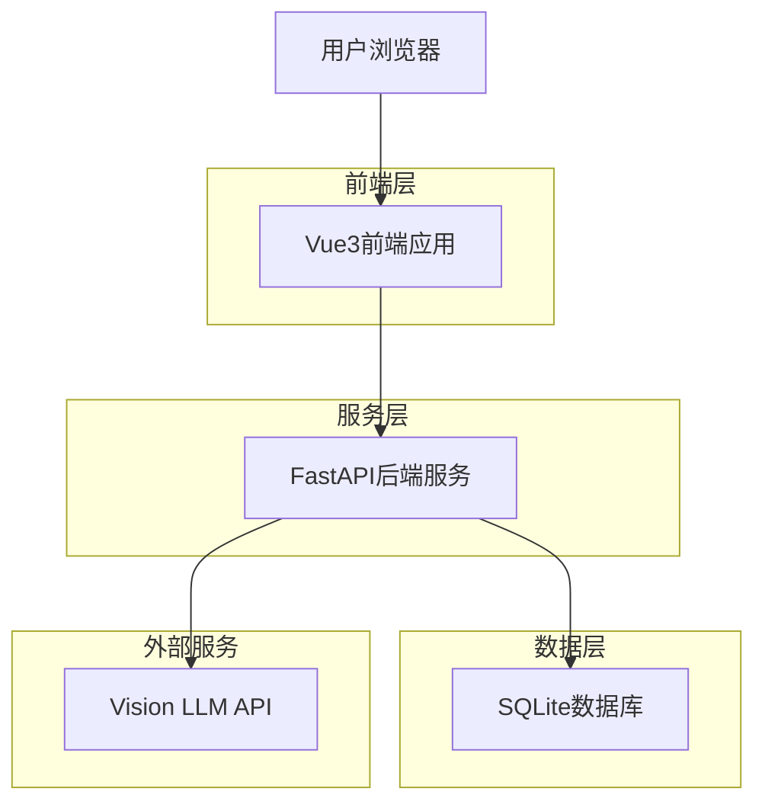
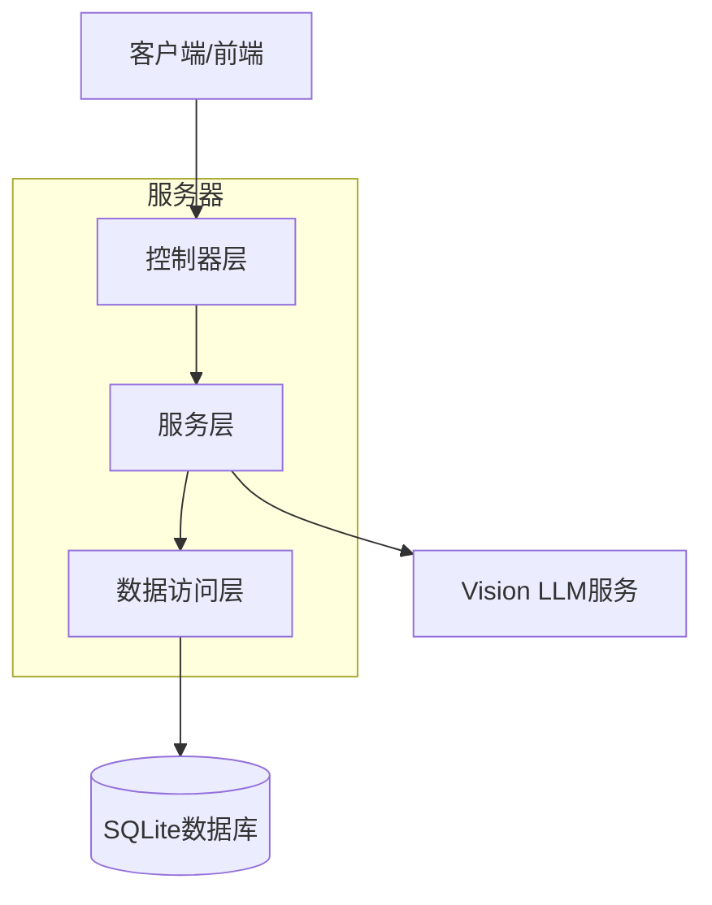
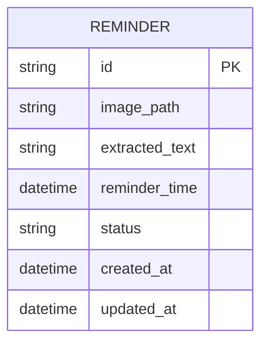

## 1. 架构设计



## 2. 技术描述

- 前端：Vue3 + Tailwind CSS CDN
- 初始化工具：无需初始化工具，使用CDN引入
- 后端：FastAPI + SQLite
- 文件存储：本地文件系统

## 3. 路由定义

| 路由 | 用途 |
|-------|---------|
| / | 首页，显示截图上传和提醒列表 |
| /reminder/{id} | 提醒详情页，显示具体提醒内容和状态管理 |
| /api/upload | 图片上传接口 |
| /api/reminders | 提醒列表API |
| /api/reminder/{id} | 单个提醒操作API |

## 4. API定义

### 4.1 图片上传API

```
POST /api/upload
```

请求：
| 参数名 | 参数类型 | 是否必需 | 描述 |
|-----------|-------------|-------------|-------------|
| image | file | 是 | 图片文件 |

响应：
| 参数名 | 参数类型 | 描述 |
|-----------|-------------|-------------|
| success | boolean | 上传状态 |
| reminder_id | string | 生成的提醒ID |
| message | string | 处理信息 |

### 4.2 获取提醒列表API

```
GET /api/reminders
```

响应：
| 参数名 | 参数类型 | 描述 |
|-----------|-------------|-------------|
| reminders | array | 提醒列表 |
| total | number | 提醒总数 |

### 4.3 更新提醒状态API

```
PUT /api/reminder/{id}
```

请求：
| 参数名 | 参数类型 | 是否必需 | 描述 |
|-----------|-------------|-------------|-------------|
| status | string | 是 | 提醒状态 |
| reminder_time | string | 否 | 提醒时间 |

## 5. 服务器架构图



## 6. 数据模型

### 6.1 数据模型定义



### 6.2 数据定义语言

提醒表（reminders）
```sql
-- 创建表
CREATE TABLE reminders (
    id TEXT PRIMARY KEY,
    image_path TEXT NOT NULL,
    extracted_text TEXT,
    reminder_time DATETIME,
    status TEXT DEFAULT 'pending' CHECK (status IN ('pending', 'completed', 'expired')),
    created_at DATETIME DEFAULT CURRENT_TIMESTAMP,
    updated_at DATETIME DEFAULT CURRENT_TIMESTAMP
);

-- 创建索引
CREATE INDEX idx_reminders_status ON reminders(status);
CREATE INDEX idx_reminders_reminder_time ON reminders(reminder_time);
CREATE INDEX idx_reminders_created_at ON reminders(created_at DESC);
```

## 7. 异步处理流程

1. 用户上传图片后，系统立即返回上传成功响应
2. 后台异步调用Vision LLM API进行内容提取
3. 提取完成后更新提醒记录
4. 根据提取的时间信息设置提醒定时任务
5. 到达提醒时间时触发通知机制

## 8. 文件存储策略

- 上传的图片存储在本地文件系统
- 文件路径格式：`uploads/{user_id}/{timestamp}_{filename}`
- 定期清理过期图片文件（可配置保留时间）
- 支持图片压缩和缩略图生成